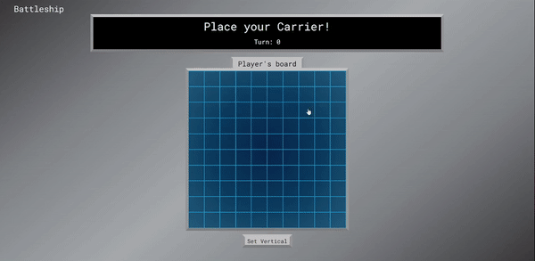

# Battleship

<a href="https://kfig21.github.io/battleship/" target="_blank" rel="noopener noreferrer">View the project here!</a> 👀

<h3>Summary</h3>

This project was built for <a href="https://www.theodinproject.com/paths/full-stack-javascript/courses/javascript/lessons/battleship" target="_blank" rel="noopener noreferrer">The Odin Project's</a> JavaScript curriculum. Place your ships vertical or horizontal to setup your board and begin selecting spaces on the computer's board to attack. When the computer lands an attack it will know which spaces to target next and it will not fooled by edge placement or ships being placed next to each other. This project was made with the React JS Library and CSS.

 <h3>Technologies:</h3>
  <ul>
  <li>ReactJS</li>
  <li>CSS</li>
 </ul>

<h3>Features: </h3>

- AI that seeks preferred targets when it gets adjacent hits.
- AI that is not confused by edge placement or ships placed next to each other
- Responsive Design

<h3>Demo GIF</h3>

<h4>Desktop</h4>

<h4>Mobile</h4>

-----------------------------

<h3>Thanks for checking out my project! Any && all feedback is appreciated!</h3>
